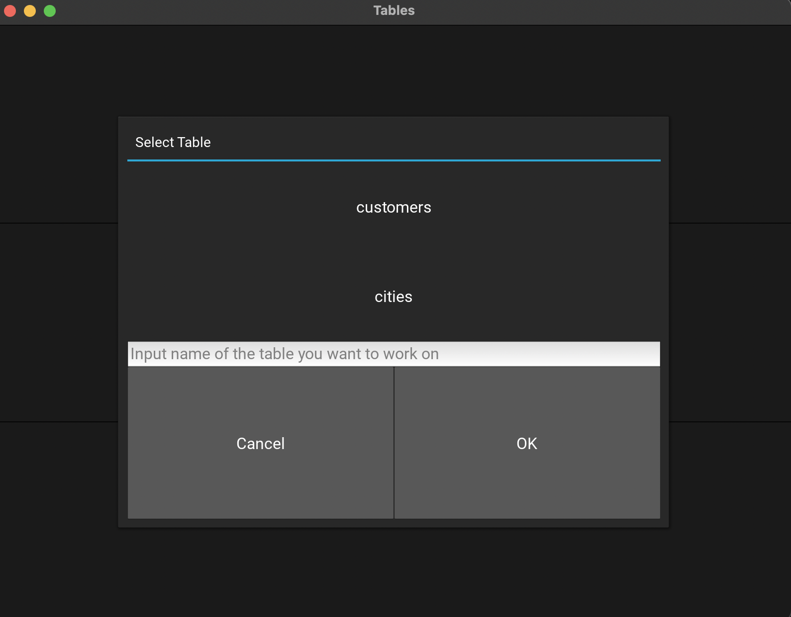

# Tables_Builder_Lite

## Info about project ##
This is my first (not so fully) completed database-related project. I used PostreSQL database managment system, 
and Heroku platform to store my database in the cloud. 
Also, this is the first time when I used Kivy framework to develop application.

## What is this application? ##
It's very basic GUI which allows user to:
* create new tables in database (with two available data types of column)
  * integer
  * text
* add new rows to existing tables
* look through table's records
* delete existing tables from database

As I mentioned, It's not completed project and there is a lot of features which hopefully I will add in the not too-distant-future.

<p float="left">
  
   
  
  
  
  
  
</p>

## Running Code ##
If You want to test this application on your own, please make sure you have access to PostgreSQL database (I'm pretty sure that MySQL databse won't work, due to small diffrences in commands' syntax of these two database management systems), and modify this function:
```python
def init_cursor_connection():

    connection = psycopg2.connect(
        host="ec2-3-222-74-92.compute-1.amazonaws.com",
        database="d13c1bqtsscttg",
        user="qvylxhkqjibady",
        port="5432",
        password=os.environ.get('PROJECTSQLPASSWD_1'),

    )

    cursor = connection.cursor()
    return cursor, connection

```
In a way to make valid connection with your postgreSQL database.
